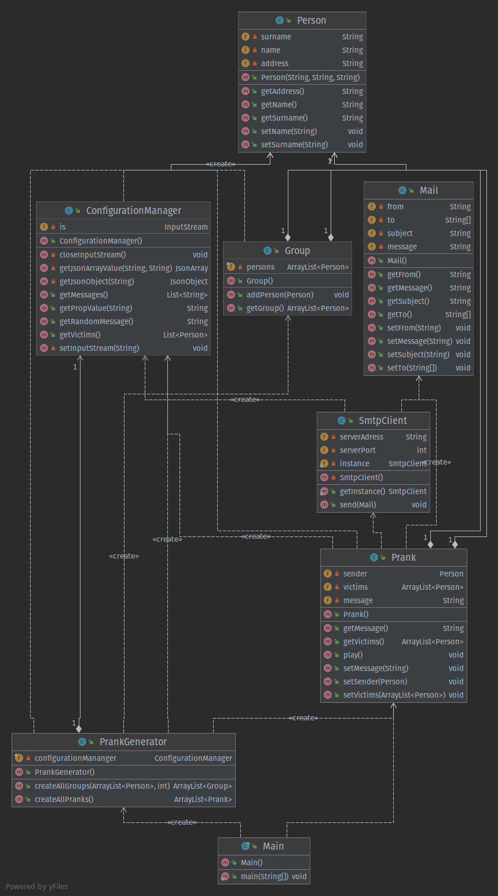

# Teaching-HEIGVD-RES-2021-Labo-SMTP

The main purpose of this project is to learn the SMTP protocol by implementing an application who plays pranks.

The application is a TCP client in Java who uses the socket API to communicate with an smtp server.

TODO: add more details

## Prerequisites

* Java 11 or greater
* Maven
* Docker (only needed for the docker mock server)

## Install instructions

First step is to create the config files from templates by running the following commands:

__Linux__

```bash
cd <app_root>/src/main/resources
cp config.properties.example config.properties
cp messages.json.example messages.json
cp victims.json.example victims.json
```

__Windows__

```bat
cd <app_root>\src\main\resources
copy config.properties.example config.properties
cp messages.json.example messages.json
cp victims.json.example victims.json
```


Next you'll need to update the following files inside `src/main/resources`:

* `config.properties`: this file contains the configuration for the application
* `messages.json`: this file contains a list of messages to send
* `victims.json`: this file contains a list of victims for your pranks

Once you've configured the previous files with your how settings and data you can install the dependencies  and build and execute the application with the command `mvn compile exec:java`


## Setup a mock SMTP server with Docker


__Linux__
* Download docker
* Run the commands :
```bash
TODO : check if this command is correct for linux

cd <repo>/docker
docker build --tag server_mockmock ./DockerfileServer
docker run -d -p 25:25 -h 8282:8282 server_mockmock
```

__Windows__

* Download docker
* Run the commands :
```bash
cd <repo>\docker
docker build --tag server_mockmock ./DockerfileServer
docker run -d -p 25:25 -p 8282:8282 -h 8282:8282 server_mockmock
```


## Description of implementation

We have spitted our application logic into 4 different packages that are described bellow



### Config

This package contains a class named ConfigurationManager that is used to read values from configuration files

### Mail

This package contains all classes needed to manage mails:

* Group: this class represents a group of people
* Person: this class represents a person
* Mail: this class represents an email

### Prank

This package contains all the logic related to the pranks

* PrankGenerator: this class is used create a new prank campaign following configuration files
* Prank: this class represents a prank


### SMTP

This package contains a class named SmtpClient who is the java smtp client who used to communicate with an smtp server.
